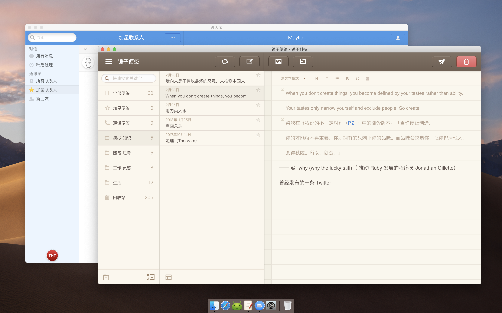
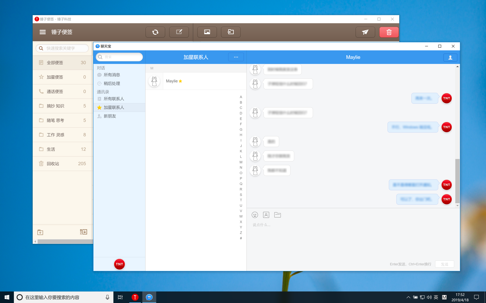
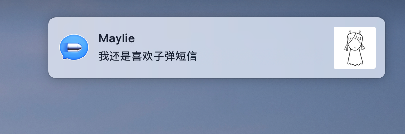
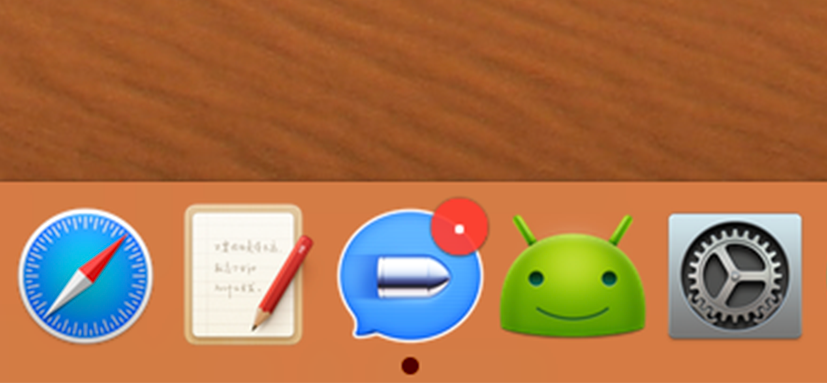

#### 「少废话，先看东西」：

#### 下载链接：

- [锤子便签 for Mac（非官方）](https://github.com/minimalistrojan/Smartisan-Desktop-Apps-Unofficial/releases/download/v1.0/Smartisan.Notes.Unofficial.dmg)
- [子弹短信 for Mac（非官方）](https://github.com/minimalistrojan/Smartisan-Desktop-Apps-Unofficial/releases/download/v1.0/Bullet.Message.Unofficial.dmg)
- [锤子便签 for Windows（非官方）](https://github.com/minimalistrojan/Smartisan-Desktop-Apps-Unofficial/releases/download/v1.0-win/Smartisan.Notes.Unofficial.zip)
- [子弹短信 for Windows（非官方）](https://github.com/minimalistrojan/Smartisan-Desktop-Apps-Unofficial/releases/download/v1.0-win/Bullet.Message.Unofficial.zip)

这四款非官方 App 均基于 [jiahaog](https://github.com/jiahaog)/[nativefier](https://github.com/jiahaog/nativefier) 工具制作，也就是所谓的「套壳版」。Mac 版由我制作，Windows 版由 [Maylie](https://github.com/Maylie1918) 制作。

Mac 版安装像其他 App 一样，打开 .dmg 镜像包将应用拖拽至「应用程序」文件夹即可。（哦对了，在「子弹短信」的 .dmg 镜像包中有一个彩蛋等待你去发现。）

Windows 版需保留你下载 .zip 解压后的整个文件夹，然后点击文件夹中的 Smartisan Notes.exe / Bullet Message.exe 即可运行。为了方便，你可以为它们创建桌面快捷方式。此外，Maylie 为「子弹短信」制作了多种图标版本，点击相应版本即可使用。

关于这几款 App ，你可能会有一些疑问，我们将他们提前整理在这里，希望对你有帮助。

#### FAQ

1. **为什么「子弹短信」打开后标题栏显示为「聊天宝」？**

   没什么好说的，[20190115.t.tt](https://20190115.t.tt) 。

2. **「子弹短信」是否可以像其他原生（非「套壳版」）Mac / Windows 桌面应用一样，在 App 图标上显示未读角标，并且在通知中心收到即时消息推送？**

   经测试：

   - Mac 版：可以在通知中心收到推送；Dock 图标可以显示角标，但是红色圆点，而非数字

     

     

   - Windows 版：在通知中心无法收到推送

3. **关于「子弹短信」的英文名。**

   在官方视频中，「子弹短信」的英文发音为 Bullet Messenger ，而在官网介绍的 TNT 截图中为 Bullet Message 。最终我们取了截图中的名字。

最后，Nativefier 是一款可以将任何网站（网页）制作成本地桌面（ macOS / Windows / Linux ）应用的工具。如果你也有「把某网站制作成本地桌面应用」的类似需求，不妨试一试。这几款应用的制作灵感来自 [@SpencerWoo](https://sspai.com/user/800610/) 发布于「少数派」的文章 [《看不惯糟糕、老旧的桌面客户端？直接让网页版应用做你的桌面 App》](<https://sspai.com/post/50250>) ，如果你对制作过程感兴趣，推荐阅读。